PARTE DE MODELOS - PRACTICA 17

Primero creamos la base de datos y la dejamos vacia
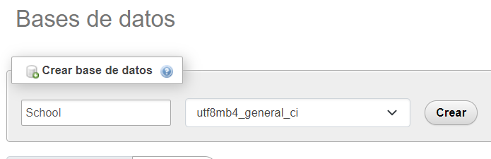

Ahora vamos al proyecto y creamos los modelos de Alumnos,  
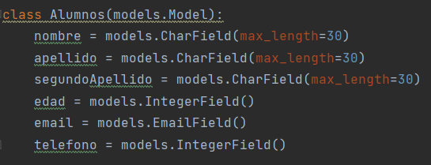

y de Profesores  
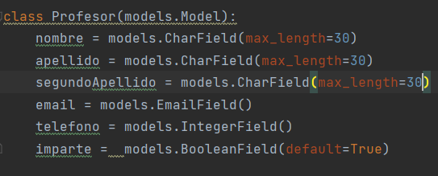

Despues hacemos la migracion con makemigration y migracion
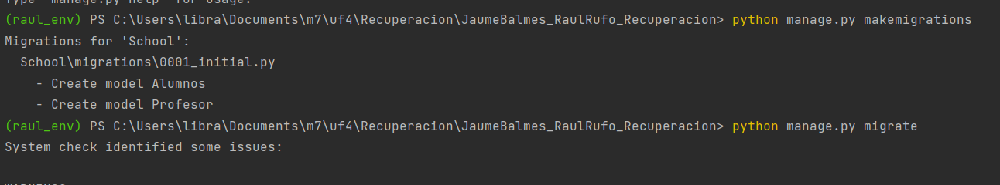

Y por ultimo vamos a la base de datos y 
comprovamos que estan creadas las migraciones

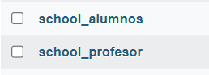

PARTE DE FORMULARIOS - PRACTICA 18

Primero creamos el archivo form.py en el que haremos la 
consulta al modelo para extraer los campos de la tabla.      
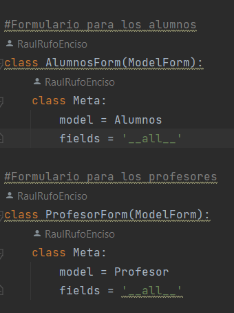

Despues nos dirijiremos a las views y crearemos los metodos
para contactar con la tabla y hacer el POST para enviar los
datos recogidos del formulario y enviarlos a la base de datos.   
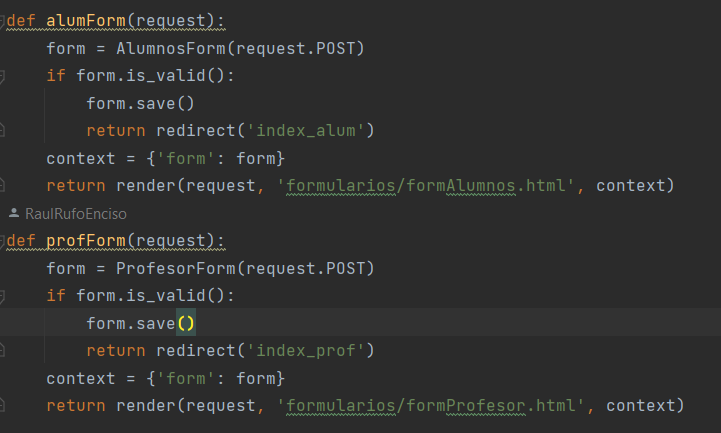       
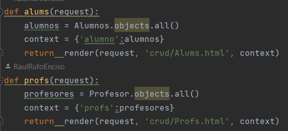     

Para acabar crearemos en la carpeta templates una subcarpeta 
llamada formularios en los que añadiremos los dos form.html.
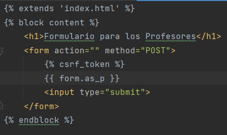      
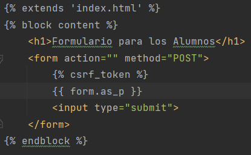     

Finalmente le asignaremos las rutas en el archivo urls.py de 
nuestra app a los metodos y ajustaremos el index.html para 
poder mostar los formularios.  
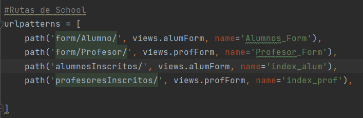         
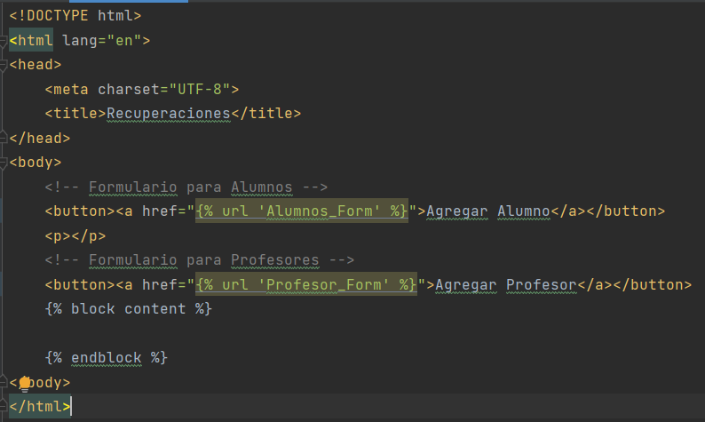
